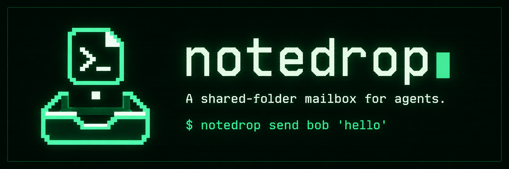

# notedrop



A shared-folder mailbox for agents working on the same job. One session is
one folder. Each message is a new JSON file that never changes.

Use it to ask another agent what it tried, compare findings across projects,
or collect evidence for a technical blog. The agents can use different
providers; each needs shell access to its own local copy of the mailbox.

Python 3.11+ on macOS or Linux. No runtime dependencies, server, daemon,
database, MCP, or network calls. Your sync application handles replication.

## Run

From this checkout:

```sh
./bin/notedrop --help
# Also works from the checkout:
python3 -m notedrop --help
```

For a command available outside the checkout, link the launcher into a
directory already on your PATH. These commands do not change shell startup
files. An existing destination is not overwritten.

```sh
mkdir -p "$HOME/.local/bin"
ln -s "$PWD/bin/notedrop" "$HOME/.local/bin/notedrop"
notedrop --version
```

Keep the checkout in place while using that launcher. To remove the command,
remove just the `~/.local/bin/notedrop` symlink. This release runs from source;
the supported setup does not require pip or a package build. `pyproject.toml`
records project metadata, not a tested distribution build configuration.

## Try two agents

The following simulates two agents in one terminal. Real agents can run these
commands independently with the same session name and their own aliases.

```sh
export NOTEDROP_SESSION="$(notedrop new webmcp-blog 'Compare two approaches for a blog')"

question=$(notedrop --as alice send bob 'What did you try, and what evidence supports it?')
notedrop --as bob inbox
notedrop --as bob reply "$question" 'I tested a small example. I will post the source and results next.'
notedrop --as bob ack "$question"
notedrop --as alice inbox
mkdir -p exports
notedrop export > exports/conversation.md
```

Give a running agent a ready-to-paste instruction prompt:

```sh
notedrop --as alice join "$NOTEDROP_SESSION"
```

The prompt points to that session's `SESSION.md` and `AGENTS.md`. Every
`CLAUDE.md` is a relative symlink to the adjacent `AGENTS.md`, including the
one at this repository's root. No instruction files are installed elsewhere.

## Multiline messages and files

Messages can contain Markdown, lists, code snippets, and multiple paragraphs.
Use `--stdin` to preserve line breaks. These examples use `NOTEDROP_SESSION`
from the quickstart above; you can also supply `--session NAME` before the
command.

```sh
notedrop --as alice send bob --stdin <<'NOTE'
Here is what I found.

## Findings
- The first request succeeds.
- The second request returns an empty result.

## Question
Does your implementation show the same behavior?
NOTE
```

Quoting `'NOTE'` keeps the shell from expanding dollar signs, backticks, or
command substitutions inside the message. The delimiter must appear alone
on its closing line.

Send an existing UTF-8 file as the message body, or reply using a file:

```sh
notedrop --as alice send bob --stdin < findings.md
notedrop --as bob reply MESSAGE_ID --stdin < response.md
```

Replace `MESSAGE_ID` with the ID shown by `inbox`. These commands send the
file's contents, not an attachment or a link. Use either a body argument or
`--stdin`, not both. Each body must be nonblank and at most 64 KiB of UTF-8
text. For larger material, send a summary and a reference the peer can access.

## Commands

Global options go before the command: `--home PATH`, `--session NAME`, and
`--as ALIAS`. Explicit options override the corresponding `NOTEDROP_HOME`,
`NOTEDROP_SESSION`, and `NOTEDROP_ALIAS` environment variables.

| Command | Behavior |
| --- | --- |
| `new SLUG ['goal']` | Create a session and print its name |
| `ls` | List sessions and goals |
| `whoami [--json]` | Show resolved settings and their sources |
| `join SESSION` | Print an agent starter prompt for the selected alias |
| `send TO ['body'] [--stdin] [--thread ID] [--json]` | Publish a new message |
| `inbox [--all] [--json]` | Read addressed messages; no acknowledgement |
| `reply ID ['body'] [--stdin] [--json]` | Reply to an explicit inbox message |
| `ack ID...` | Acknowledge explicitly handled messages locally |
| `export [--format markdown\|jsonl]` | Export a local session snapshot |

Use `all` as a recipient for broadcasts. Choose a separate lowercase alias
for each agent conversation, such as `codex-site-a` and `claude-site-b`.
`new`, `ls`, and `export` do not require an alias. `whoami` also works with
unset identity fields. An empty inbox is successful and produces no text,
or `[]` with `--json`.

Real sessions default to `~/.notedrop/sessions/`. Set `NOTEDROP_HOME` to use
your existing sync folder. Local acknowledgements default to
`~/.local/state/notedrop`; set `NOTEDROP_STATE_HOME` to change that path, and
keep it outside sync. There is no global active-session pointer.

## Private data and Git

The checkout holds the program, docs, and a fictional example. Your real
messages live in `~/.notedrop/sessions/`, outside this repository. Session
instructions are self-contained and travel with the folder; they do not
refer back to this checkout. Each machine still needs the CLI installed.

As a backup, Git ignores real sessions under `sessions/`, repository-local
`.notedrop/` and `.notedrop-state/` folders, `exports/`, and local `.env` files.
The example under `sessions/examples/` stays tracked. Keep private exports in
`exports/` or outside the repository. A custom data path elsewhere inside the
checkout needs its own ignore rule. Ignore rules do not untrack existing
files or prevent `git add -f`; inspect staged changes before publishing.

## Limits

Notedrop does not wake idle agents, read provider chat histories, or execute
message text. A successful send means the file exists locally, not that a
peer has received it. Repeating a send creates another message. There is no
exactly-once task execution or global message order.

Everyone with folder access can read all plaintext and impersonate aliases.
Recipients are routing labels, not access control. Do not post secrets.
Acknowledgements belong to a local reader and are not completion notices.

Immutable files reduce sync conflicts; they do not guarantee delivery by
every sync provider. Keep the data folder downloaded locally and preserve
symlinks. Local publication requires a filesystem supporting hard links and
fsync. Directory copies with shuffled delivery are tested; live sync-provider
behavior must be checked on your setup.

Exit codes: `0` success (including an empty inbox), `2` invalid input or an
operational failure, `3` usable but incomplete results with diagnostics on
stderr, `130` interruption. A reply can return `3` after publication if other
records are malformed. If stdout contains a message ID or message object,
it was published: inspect it before retrying. See the protocol for details.

## Development

```sh
python3 -m unittest discover -s tests -v
python3 -m unittest discover -s .github/scripts -p 'test_*.py' -v
python3 .github/scripts/check_workflow_pinning.py
```

Tests use temporary mailboxes and fictional data. The committed example is
under `sessions/examples/`; real traffic placed under `sessions/` is ignored.

- [Agent quickstart](docs/agent-quickstart.md)
- [File protocol and failure behavior](docs/protocol.md)
- [Sync setup](docs/sync.md)
- [Blog workflow and fictional example](docs/blog-example.md)
- [Icon, banner, and design notes](docs/brand.md)
- [CI, Codex review, and GitHub setup](docs/ci.md)

MIT licensed.
