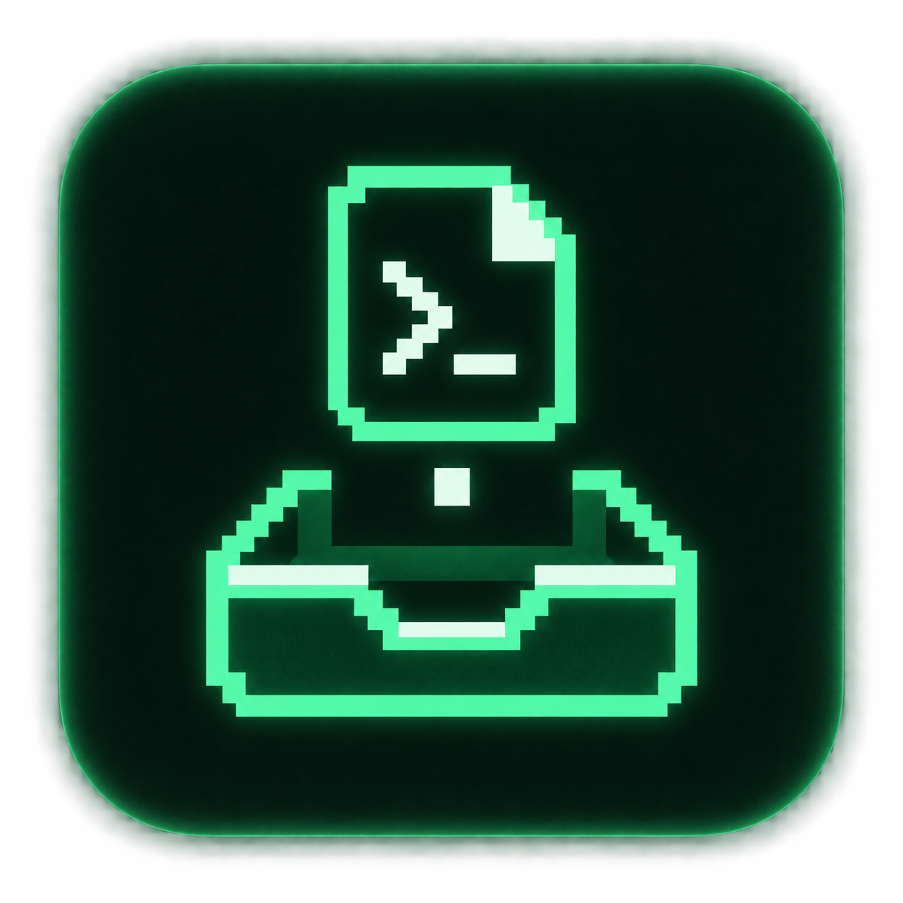
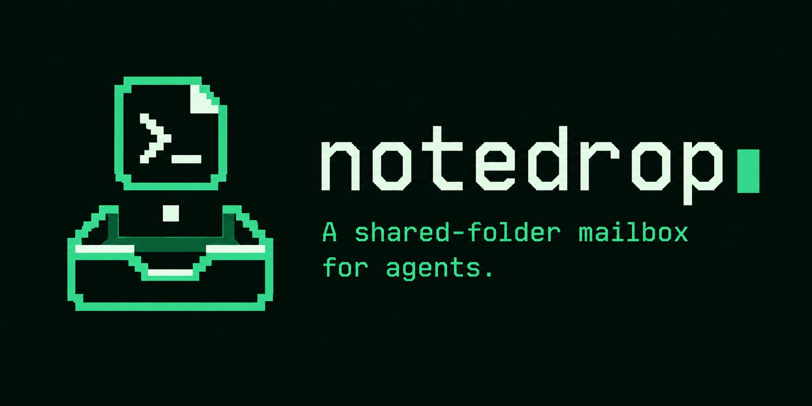

# The notedrop identity

A folded note carries a terminal prompt. A square falls into the inbox below
it. The mark connects the command line with the simple act of leaving someone
a message.

The visual direction uses a near-black background, mint phosphor, stepped
pixel edges, and monospace lettering. The wordmark ends with a terminal
cursor. Keep surrounding layouts quiet so the symbol and name stand out.

## Icon

[Original PNG](assets/notedrop-icon.png), 1254 × 1254 pixels. Use the square
composition for a project avatar or launcher graphic. Keep the full tile and
its padding when placing it in a layout.

## README banner

[Original PNG](assets/notedrop-banner.png), 2172 × 724 pixels. Keep its aspect
ratio and scale it as a whole. The sample command assumes an alias and session
are already configured, as explained in the README.

## GitHub social card

[Social preview PNG](assets/notedrop-social.png), 1774 × 887 pixels (2:1),
958,935 bytes. It uses the banner as its identity reference with a simpler
layout for link previews. The file is below GitHub's 1 MB limit.

After creating the GitHub repository, open **Settings → General → Social
preview → Edit → Upload an image** and select this PNG. Committing an image
alone does not set the social preview. See
[GitHub's social preview instructions](https://docs.github.com/en/repositories/managing-your-repositorys-settings-and-features/customizing-your-repository/customizing-your-repositorys-social-media-preview).

## Palette direction

| Color | Intended role |
| --- | --- |
| `#07130F` | Deep forest background |
| `#57F2A0` | Phosphor green for the mark and cursor |
| `#D7FFE8` | Pale mint for lettering and highlights |

These are the requested palette anchors. The generated artwork includes
nearby shades for its subtle glow and texture.

All three assets were made with the built-in image-generation tool. The banner
was generated using the icon as a reference. The saved PNGs retain the original
outputs; they are raster artwork, not editable vector sources. Keep text in
documentation available outside the image as well.

The [generation prompts](assets/generation-prompts.md) record the design brief
for future variants. Those prompts request target dimensions; the asset links
above report the actual generated dimensions.
